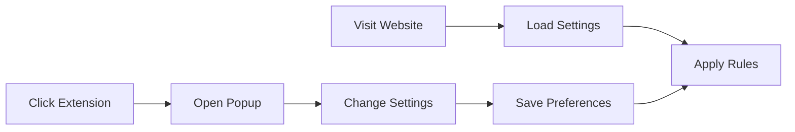

# Project Details: Xiaohongshu Feed Blocker

## Project Goal

A lightweight Chrome extension that blocks the main feed content on Xiaohongshu (小红书) website to help users reduce distractions and improve focus.

## Technical Details

-   **Extension Type**: Chrome Extension
-   **Core Features**:
    - Automatically hides feed content on Xiaohongshu pages
    - Popup interface with toggle options for feed visibility
    - Configurable settings for search and profile pages
    - Persists user preferences across sessions
-   **Implementation**:
    - Uses content script to manage feed visibility
    - Targets feed element with CSS selector `div.feeds-container`
    - Employs MutationObserver for dynamic content handling
    - Stores settings using Chrome's storage sync API

## Extension Flow

## Basic Operation

1. Extension activates when user visits Xiaohongshu
2. Content script checks saved preferences and applies feed visibility rules
3. Users can customize settings via the popup interface
4. Changes take effect immediately and persist across sessions